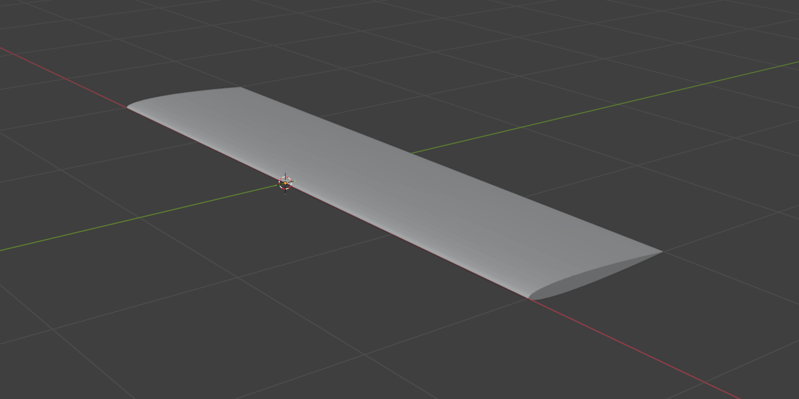
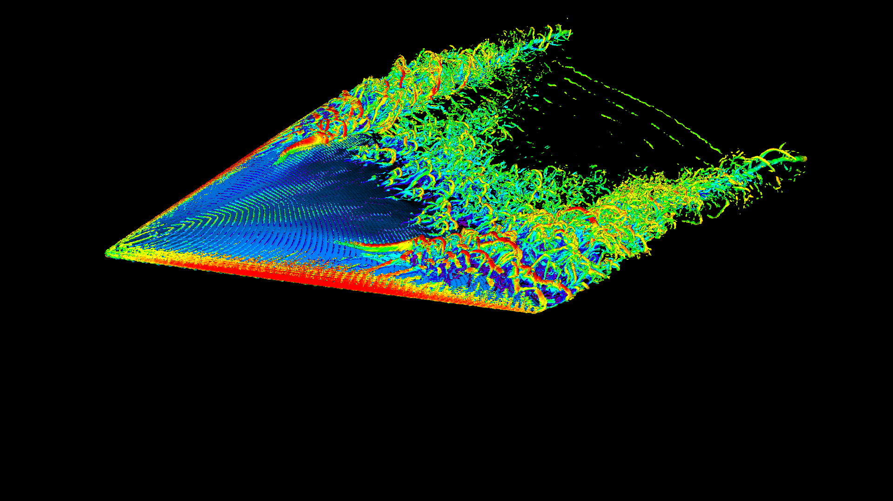
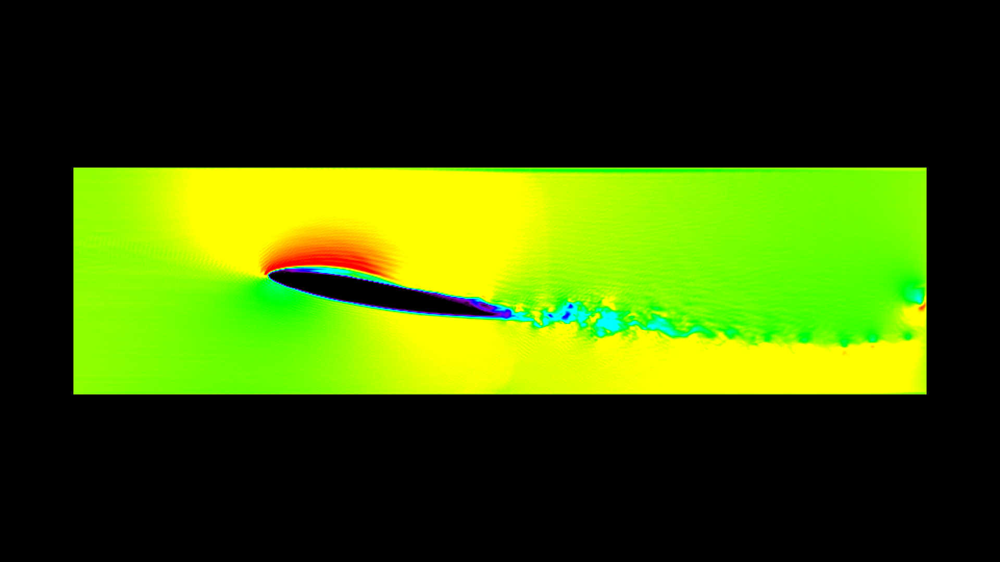

# Models and simulation project
*Martin Sun*

*Oskar Gandois*

## How to run

To run the simulations, first download the FluidX3D source code from [GitHub](https://github.com/ProjectPhysX/FluidX3D), either by cloning the repo or downloading the source code as a .zip file. Next, replace the ``setup.cpp`` and ``defines.hpp`` files in the FluidX3D ``src`` folder with the files located in the ``src`` folder in this repo. Finally, copy this repo's ``stl`` folder into the FluidX3D root directory. The program can now be executed using Visual Studio. Simulation parameters can be modified within the ``setup.cpp`` file.

## Project blog

### Week 11

This week consisted of finishing the wing simulations, as well as finishing the report. We completed the sims of the swept and trapezoidal wings by mid-week, while in parallel finishing the first sections of the report (introduction, background and method). Once the simulation results were in, we created some plots in Python and started working on the results and discussion part of the report. The final report was completed on Friday.

### Week 10

The focus of this week was to get all of the simulations done so that we could focus on the report next week. We decided to base our code on an existing example solution (the Boeing 747 sim), though we eventually ended up heavily modifying almost everything.

Initially it started of fine, however we soon ran into problems concerning the realism of the simulations, mainly as a result of our lackluster computing hardware (we were running the sims on a single RTX 4060 GPU). As a result, we had to pivot from our original idea of examining high aspect ratio wings and instead perform our sims on low aspect ratio wings, as this allowed us to increase the resolution of the sim. Eventually, we settled on three low aspect ratio wings: a delta wing, a swept wing and a trapezoidal wing. We also experimented with all kinds of simulation parameter configurations in order to get the most accurate results on our limited hardware.

Meanwhile, we also started investigating different airfoils and wing configurations. We considered several airfoils in the NACA range, from NACA0006 all the way up to NACA0012; the main difference between these are that they vary in thickness. We ended up using the NACA001034 airfoil, as we deemed it as a good "general purpose" airfoil due to its simple shape and symmetrical profile, as well as being moderatly thick. We went though several iterations modeling the wings in Blender before we settled on the final design. Below is an example of one of the first wings we modeled (a straight wing), which we did not end up using as its aspect ratio was too high to yield good results:

Once we had decided our airfoil, as well as worked out most of the issues regarding simulation, we started modeling the actual wings that would be used in the sim and started running the simulations. Below are some images of one of our first simulation runs using the delta wing:

We ended up making alot of small adjustments to the simulation parameters, as well as the wing models so these images were not used in the final results. By the end of the week, we had managed to finish all the simulations for the delta wing. Around this time, we also laid down the basic structure of our report and started writing the first draft.

### Week 9

This week was the kickoff week for the modsim project. We mainly spent our time brainstorming ideas and developing our project specification. After discussion with our TA, we settled on a project idea consisting of comparing the aerodynamic performance of different aircraft wings, using the CFD simulation tool FluidX3D.

Initially, our plan was to simply examine the lift properties of different wing planforms. After further discussion, we instead decided to focus on investigating stall behavior in different wings, as this seemed quite a bit more interesting to us.

By the end of this week, we managed to get FluidX3D up and running and tested out some of the example simulations that were already in the source code.

